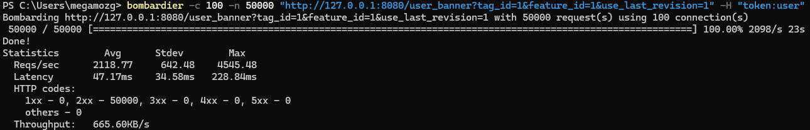
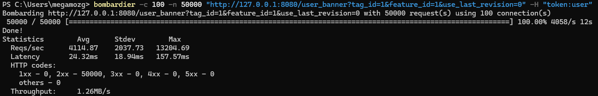
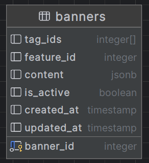

# avito-banners

тестовое задание для стажировки в avito.tech.
[Репозиторий заданиия](https://github.com/avito-tech/backend-trainee-assignment-2024).

## Технологический стек

Go, Postgres, Memcached, Docker

## Нагрузочное тестирование

Без использования кеширования:

С использованием кеширования:


## Запуск

1. Клонировать репозиторий
   ```git clone https://github.com/vbg911/avito-banners.git```
2. Перейти в директроию deployments
```cd deployments```
3. Запуск
```docker compose up --build```

приложение запустится на порте 8080

## Postman
[](https://god.gw.postman.com/run-collection/24125419-52a4fe22-f489-4e6e-b166-a000935a8c29?action=collection%2Ffork&source=rip_markdown&collection-url=entityId%3D24125419-52a4fe22-f489-4e6e-b166-a000935a8c29%26entityType%3Dcollection%26workspaceId%3D6c79f8a0-6d46-4e43-be26-f2e80e87d5ac)

## Структура используемой таблицы


